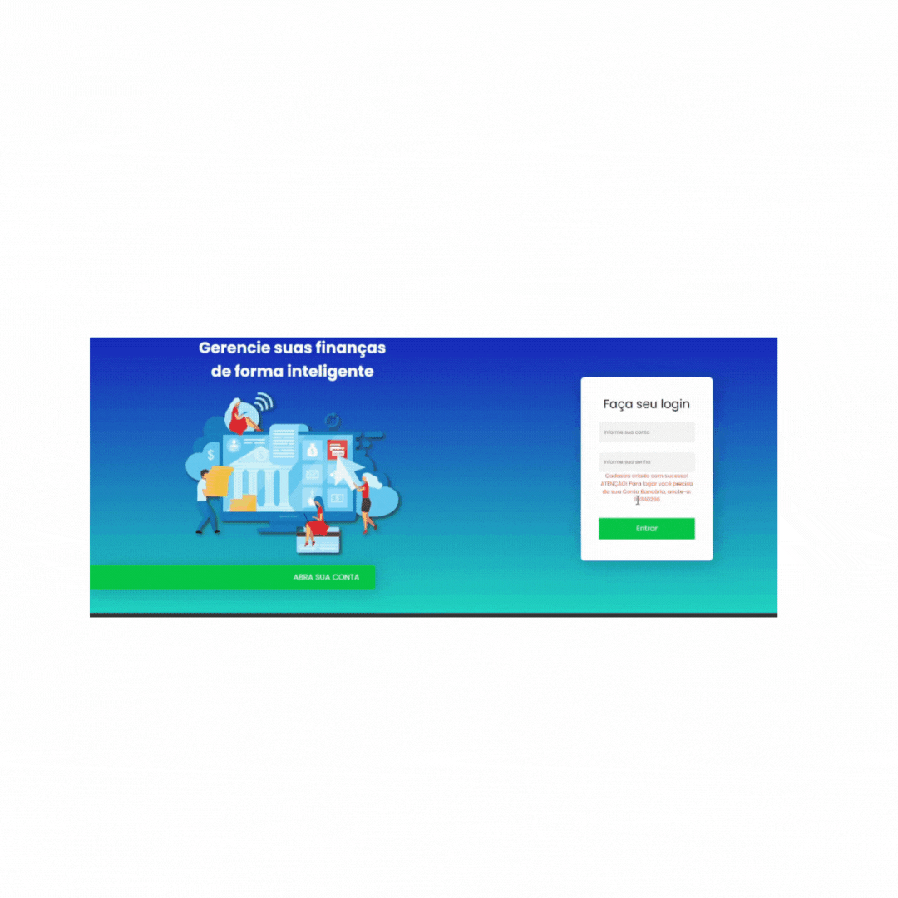

  

  <h1> Olá, meu nome é Jonas Rafael Siqueira Ribeiro!</h1>

Tenho 26 anos, sou Desenvolvedor de Softwares em formação, focado em desenvolvimento fullstack em Javascript (MySQL ORM, Express, React e Node) e Java (POO, Springboot, JPA, JDBC, Security e Hibernate). Além de gerenciamento de banco de dados MySQL e PostGres.

   
  

  
  
  
  
  

 

<h2>Meus Projetos</h2>

## :bookmark_tabs: NineTech - Gerenciamento de Times e Projetos Complexos (WBS)

      

- 2023.2
- [Acesse aqui o repositório NineTech](https://github.com/Nine-Tech/nine-tech-documentation)
- Desenvolvido para o Projeto Integrador 3 da FATEC, com a [SIATT](https://www.siatt.com.br/siatt/) como cliente.  Utilizando as metodologias Scrum, atuei como Product Owner e Development Team.

Nossa parceira, a empresa Siatt, enfrenta o desafio de gerenciar eficazmente seus projetos estratégicos em um cenário de complexidade, apresentamos uma solução abrangente e flexível, um Sistema de Gerenciamento de Times para Projetos Complexos. Esse sistema foi projetado para atender às necessidades específicas da Siatt, permitindo tanto um macro gerenciamento quanto um micro gerenciamento dos projetos.

### :warning: Dificuldades

> _Contratempos que afetam a eficiência operacional, a comunicação eficaz e a capacidade de monitorar o progresso dos projetos e suas etapas em tempo real. Estes desafios incluem dificuldade de gestão apropriada e um acompanhamento adequado dos projetos, juntamente com uma interface de usuário pouco amigável e problemas relacionados à integridade dos dados._

### :white_check_mark: Proposta de Solução

> _Um software especializado que permita importar dados de projetos em andamento a partir de arquivos Excel, para facilitar a migração de dados e a transição para um novo sistema de gerenciamento. A partir disso, o Engenheiro Chefe pode atribuir pacotes de trabalho e observar cada mudança do projeto e seus pacotes, subpacotes e tarefas. Melhorando a organização, o acompanhamento em tempo real e a colaboração entre as diferentes etapas do projeto. Já os Líderes de Projeto, têm acesso individual apenas aos seus Pacotes, podem gerenciá-los e acompanhar o andamento. De forma intuitiva, amigável e de usabilidade alta._

## :bookmark_tabs: Tecnologias Utilizadas

- JavaScript:

> _JavaScript é uma linguagem de programação de alto nível, amplamente utilizada para desenvolvimento web. Ela permite a criação de interações dinâmicas em páginas web e é suportada pelos navegadores modernos._
> _O JavaScript foi muito importante para o desenvolvimento do front-end, principalmente por possibilitar chamar a API em Java, através de requisições assíncronas, de forma atualizar dinamicamente, por meio de interação do Usuário com o DOM, páginas em HTML e CSS_

- React:

> _React é uma biblioteca de JavaScript para construção de interfaces de usuário (UI). Desenvolvida pelo Facebook, ela permite a criação de componentes reutilizáveis que atualizam automaticamente quando os dados mudam. React é amplamente usado no desenvolvimento de aplicações web interativas e single-page._
> _Essa biblioteca desempenhou um papel vital no avanço do front-end, permitindo uma abordagem  fluida, atualizando partes específicas da página sem recarregar tudo. Através dele foi possível gerenciar o estado da aplicação de maneira mais simples, proporcionando uma experiência de usuário mais responsiva.

- Java:

> _Java é uma linguagem de programação de propósito geral conhecida por sua portabilidade, segurança e robustez. É frequentemente usada para desenvolvimento de aplicativos empresariais e sistemas distribuídos._
> _Desempenhou um papel fundamental no desenvolvimento back-end, fornecendo uma base sólida para a construção de sistemas distribuídos e aplicações escaláveis. Auxiliou o aprendizado em Programação Orientada a Objetos._

- Spring Boot:

> _Spring Boot é um framework em Java que simplifica o desenvolvimento de aplicativos baseados em Spring. Ele facilita a criação de aplicativos Java robustos, oferecendo configurações padrão e uma estrutura simplificada._
> _Reduziu a carga de trabalho dos desenvolvedores, permitindo maior concentração na lógica de negócios._

- Security e JJWT:

> _"Security" geralmente refere-se a práticas e bibliotecas para garantir a segurança de um sistema. JJWT (JSON Web Token) é uma especificação para criar tokens de acesso baseados em JSON, frequentemente usados para autenticação e autorização em aplicativos web._
> _Com o Spring Security e o JJWT, a proteção de APIs e a implementação de autenticação e autorização ficaram mais simples e eficazes._

- MySQL:

> _MySQL é um sistema de gerenciamento de banco de dados relacional de código aberto. Ele é amplamente utilizado para armazenar e recuperar dados em aplicativos, oferecendo desempenho confiável e suporte para consultas complexas._
> _Escolha comum e segura, devido à utilização anterior por parte da equipe, para armazenar dados de maneira estruturada. É uma solução eficaz para organizar grandes conjuntos de informações, sendo especialmente valioso em aplicações web._

- Docker:

> _Docker é uma plataforma de contêinerização que permite empacotar, distribuir e executar aplicativos em contêineres. Contêineres são unidades isoladas que encapsulam todos os requisitos de software e suas dependências, garantindo consistência em diferentes ambientes._
> _Primeiro contato da equipe com contêinerização, utilizamos basicamente para o MySQL para manter consistência entre o time, durante o desenvolvimento da aplicação._

### :white_check_mark: Contribuições Pessoais
Durante a primeira e segunda Sprints desempenhei um papel de Scrum Master, enquanto também desenvolvia como Back-end. Minhas principais contribuições como SM foram a criação de um Jira automatizado para estreitar o começo de uma entrega contínua, além de facilitar a versionamento de ramificações e branches utilizando o Gitflow. Como desenvolvedor contribui com o CRUD de criação da estrutura WBS por meio do upload de dados contidos em um arquivo Excel, além da conexão via Axios para alimentação do Cliente via API.
Para a terceira e quarta Sprints, devido à saída do Product Owner assumi esse cargo, continuando a desenvolver junto ao Dev. Team. Minhas maiores contribuições como PO foram reuniões via meeting com o cliente, tentando entender melhor como funcionavam os arquivos Excel, para tentar remediar suas dores e deixar mais claro ao time a visão do Produto. Como desenvolvedor participei de refatoração do Back-end para uma nvoa estrutura WBS e desenvolvi no Front-end usando Chart.JS para criação de Gráficos de Curva S.

## :bookmark_tabs: Hard Skills
- Javascript: Com contato mais prolongado à esta linguagem já tenho bastante autonomia, principalmente em se tratando de aplicações WEB (8/10), podendo focar mais em programação funcional e contexts.
- React e Axios: já consigo compreender bem e aplicar de forma autônoma (9/10).
- MySQL: Através do ORM do JPA, a manipulação de querys diretamente quase não foi utilizada, o que melhorou foi a Modelagem e a organização em um projeto complexo (9/10).
- Java: Primeiro contato com Java e forçando o Desenvolvimento Orientado à Objetos, princípios SOLID e algum Design Patterns. Além de segurança de aplicação via Security e JJWT. Para um primeiro contato acredito que o avanço foi significativo em Java puro (6/10), em Springboot deu para alcançar um nível bom (8/10), em SOLID também (8/10), Design Patterns ainda muito pouco (3/10).
- Docker: Também primeiro contato, ainda muito o que aprender (4/10).

## :bookmark_tabs: Soft Skills
- Proatividade: Tento sempre sem o mais proativo possível na equipe, fazendo de tudo o que for necessário: programar no front ou back ou aceitando novos desafios como Product Owner (9/10).
- Autonomia: Quando me atribui tarefas, tento fazê-las e concluí-las por conta própria, pedindo ajuda após alguns dias procurando a solução (8/10).
- Comunicação: A comunição nesse projeto foi algo difícil, talvez foi o que mais evoluiu. Tivemos dificuldade de comunição para entender o Produto, para organizar o time no Scrum e para resolver distribuição de Tasks e entendimento entre o time sobre elas. Saíram muitos integrantes durante as sprints, mas conseguimos conduzir o projeto até o final, tentando organizar o time em grupos menores para melhorar a comunicação (6/10).
- Entrega e Resultados:  Tivemos que enfrentar muitas horas programando para entregar os resultados, nas primeiras duas Sprints isso levou a atrasos, trabalho nos finais de semana e entrega em cima da hora. Tentamos nos organizar para entregar antes e trabalhar menos na Terceira e Quarta sprint, o que parece que foi bom e funcionou (8/10).

## :bookmark_tabs: OctAgro - Sistema de Inspeção de Entrada para Controle de Recebimento de Grãos

      

- 2023.1
- [Acesse aqui o repositório OctAgro](https://github.com/OctAgro/OctAgro-API)
- Desenvolvido para o Projeto Integrador 2 da FATEC, com a [Jaia Software](https://jaia.software/) como cliente. Utilizando as metodologias Scrum, atuei como Development Team.

Nossa parceira, a empresa Jaia Software, encara o desafio de aprimorar a gestão do controle de recebimento de grãos na agroindústria. Nossa proposta visa superar os obstáculos encontrados no processo, garantindo critérios de aprovação rigorosos e relatórios abrangentes para otimizar a eficiência operacional. As principais dificuldades identificadas incluem a falta de um sistema centralizado para inspeção de entrada, o que impacta a segurança, qualidade, manutenção e gerenciamento de riscos.

### :warning: Dificuldades

> _A ausência de um sistema eficaz de inspeção de entrada prejudica a identificação precoce de não conformidades. Isso abrange desde a inspeção da entreda da mercadoria, análise dos grãos e até a gestão de processos organizacionais, internos e externos. Além disso, a falta de critérios claros para o que será inspecionado, a periodicidade e os objetivos compromete a eficiência operacional.._

### :white_check_mark: Proposta de Solução

> _Desenvolver um Sistema de Inspeção de Entrada especializado, com foco na agroindústria. Isso facilitará a transição para um novo sistema de controle, melhorando a organização, a rastreabilidade e a colaboração entre todas as etapas do processo. O software permitirá o cadastro de usuários com diferentes perfis, definindo responsabilidades específicas para análise, recebimento e aprovação. A metodologia de recebimento será dividida em quatro etapas: entrada de materiais, conferência quantitativa, conferência qualitativa e regularização. Essa solução visa oferecer uma interface intuitiva, amigável e altamente usável, proporcionando uma gestão eficaz do controle de recebimento de grãos na agroindústria._

## :bookmark_tabs: Tecnologias Utilizadas

- JavaScript:

> _JavaScript é uma linguagem de programação de alto nível, amplamente utilizada para desenvolvimento web. Ela permite a criação de interações dinâmicas em páginas web e é suportada pelos navegadores modernos._
> _O JavaScript foi muito importante para o desenvolvimento do front-end, principalmente por possibilitar chamar a API em Java, através de requisições assíncronas, de forma atualizar dinamicamente, por meio de interação do Usuário com o DOM, páginas em HTML e CSS_

- React:

> _React é uma biblioteca de JavaScript para construção de interfaces de usuário (UI). Desenvolvida pelo Facebook, ela permite a criação de componentes reutilizáveis que atualizam automaticamente quando os dados mudam. React é amplamente usado no desenvolvimento de aplicações web interativas e single-page._
> _Essa biblioteca desempenhou um papel vital no avanço do front-end, permitindo uma abordagem  fluida, atualizando partes específicas da página sem recarregar tudo. Através dele foi possível gerenciar o estado da aplicação de maneira mais simples, proporcionando uma experiência de usuário mais responsiva._

- Node.js:

> _Node.js é um ambiente de execução de código JavaScript do lado do servidor. Ele permite que desenvolvedores usem JavaScript para escrever scripts do lado do servidor, possibilitando a construção de aplicações escaláveis e de alta performance. Com o Node.js, é possível criar servidores web e APIs de forma eficiente._
> _Essa tecnologia foi fundamental para o desenvolvimento backend, permitindo a execução de código JavaScript fora do navegador. Sua natureza assíncrona é particularmente valiosa para lidar com operações de I/O de forma eficiente, resultando em aplicações mais rápidas._

- Express.js:

> _Express.js é um framework para Node.js que simplifica o desenvolvimento de aplicações web e APIs. Ele fornece uma série de recursos e ferramentas que facilitam a criação de rotas, gerenciamento de requisições e respostas, e integração com middlewares._
> _Essa estrutura foi crucial para o desenvolvimento rápido e eficiente de aplicações backend. Foi possível criar rotas de forma simples, gerenciar o ciclo de vida das requisições e respostas, e integrar middleware para funcionalidades adicionais. Isso resulta em código mais organizado e fácil de manter._

- Sequelize:
> _Sequelize é um ORM (Object-Relational Mapping) para Node.js, que suporta diversos bancos de dados relacionais, incluindo MySQL. Ele simplifica a interação com o banco de dados, permitindo que desenvolvedores usem JavaScript para realizar operações de CRUD de maneira mais intuitiva e eficiente._
> _Essa biblioteca foi essencial para facilitar a comunicação entre a aplicação Node.js e o MySQL, além de permitir um pouco de Programação Orientada a Objetos para a aplicação. Com o Sequelize, foi possível definir modelos de dados em JavaScript que são mapeados para tabelas no banco de dados, tornando as operações de banco de dados mais orientadas a objetos e simplificando o desenvolvimento._

- MySQL:

> _MySQL é um sistema de gerenciamento de banco de dados relacional de código aberto. Ele é amplamente utilizado para armazenar e recuperar dados em aplicativos, oferecendo desempenho confiável e suporte para consultas complexas._
> _Escolha comum e segura, devido à utilização anterior por parte da equipe, para armazenar dados de maneira estruturada. É uma solução eficaz para organizar grandes conjuntos de informações, sendo especialmente valioso em aplicações web._

### :white_check_mark: Contribuições Pessoais
Pela primeira vez, desenvolvi uma aplicação fullstack. Nesse projeto, busquei implementar uma arquitetura MERN, criando uma aplicação web que integrasse todas as tecnologias mencionadas. Inicialmente, minha intenção era focar apenas no backend; portanto, estruturei essa parte do projeto e busquei aplicar novos conhecimentos que pesquisei durante as férias, como a Arquitetura Model-View-Controller e ORM. Isso se deu porque a aplicação anterior estava muito rígida e monolítica. O aprendizado rápido e a flexibilidade proporcionados pelo stack MERN me motivaram a tentar aprender também o desenvolvimento frontend, algo que inicialmente não estava nos meus planos. Ao estudar React, percebi que poderia ser uma experiência interessante. Assim, em todas as sprints, atuei como fullstack, concentrando-me especialmente no mapeamento dos dados da API para o frontend, utilizando Axios, e assimilando conceitos como useState, useEffect, Hook e Context.

## :bookmark_tabs: Hard Skills
- Javascript: Primeiro contato com esta linguagem, pude aprender como a linguagem funcionava, principalmente novos conceitos como assincronia e programação funcional. Por parte do backend as coisas se saíram bem muito devido ao Express e Sequelize (7/10), já no frontend, muitas coisas ainda eram abstratas e fugiam do meu conhecimento então, entregamos, mas com muita coisa por aprender (6/10).
- React: Parte teórica ainda por aprender, na prática já compreendi conceitos essenciais e funcionais (6/10).
- MySQL: Através do ORM do Sequelize, a manipulação de queries diretamente quase não foi utilizada, o que melhorou foi a Modelagem, mas que poderia ser melhor pensada e estruturada (6/10).

## :bookmark_tabs: Soft Skills
- Proatividade: Tento sempre sem o mais proativo possível na equipe, saindo do backend e programando também no frontend (8/10).
- Autonomia: Quando me atribui tarefas, tento fazê-las e concluí-las por conta própria, pedindo ajuda após alguns dias procurando a solução (7/10).
- Comunicação: A comunição nesse projeto foi algo muito positiva, encontrei um grupo muito bom e produtivo. Tivemos muitas conversas na pré Sprint que nos fez entender o produto muito bem. Saíram muitos integrantes durante as sprints, mas conseguimos conduzir o projeto até o final, trabalhando e estudando para suprir as necessidades tecnológicas e de pessoas que enfrentamos (9/10).
- Entrega e Resultados: Tivemos que enfrentar muitas horas programando para entregar os resultados, em todas as sprints tivemos que programar por horas extensas nos finais de semana, devido à saída inexperada de membros e falta de conhecimento técnico nas novas tecnologias, mas principalmente pois prometemos features demais. (4/10).

## :bookmark_tabs: Impactech - Internet Banking

      

- 2022.2
- [Acesse aqui o repositório Impactech](https://github.com/impactechAPI/-API-1-Internet-Banking)
- Desenvolvido para o Projeto Integrador 1 da FATEC, com a [Fatec São José dos Campos](https://fatecsjc-prd.azurewebsites.net/) como cliente. Utilizando as metodologias Scrum, atuei como Development Team.

Nossa parceira, a Instuição Fatec, nos proporciou como objetivo a criação de um sistema de Internet Banking com algumas funcionalidades básicas de todo banco, online ou físico, como: abertura de contas em agências, realizar depósitos, saques, transferências, visualizar extrato de transações, atualização de dados cadastrais, crédito especial para clientes e solicitação de fechamento de contas.

### :warning: Dificuldades

> _Com a crescente digitalização dos serviços bancários, a ausência de um sistema eficaz para Internet Banking pode resultar em experiências inadequadas para os usuários. Processos que tradicionalmente eram realizados presencialmente, como transferências, consultas de saldo e pagamentos, tornam-se mais complexos sem uma plataforma digital integrada. A falta de critérios claros para a segurança, acesso e funcionalidades compromete a eficiência operacional e a acessibilidade para os clientes._

### :white_check_mark: Proposta de Solução

> _Propomos o desenvolvimento de um Sistema de Internet Banking personalizado, com foco na simplificação e acessibilidade. Essa solução permitirá uma transição suave para operações bancárias digitais, melhorando a organização, a segurança e a colaboração entre as diferentes transações. O software possibilitará o cadastro de usuários com perfis distintos, atribuindo responsabilidades específicas para funcionalidades como transferências, pagamentos, consultas e atualizações de dados._

## :bookmark_tabs: Tecnologias Utilizadas

- Python:
> _Python é uma linguagem de programação de alto nível, conhecida por sua sintaxe clara e legibilidade. Ampla e versátil, ela é utilizada em diversos contextos, desde desenvolvimento web até análise de dados e inteligência artificial. Com uma comunidade ativa e vasta biblioteca padrão, Python torna-se uma escolha poderosa para desenvolvedores.
> _Essa linguagem destacou-se pela facilidade de aprendizado e flexibilidade, proporcionando uma experiência de desenvolvimento ágil e um ótimo primeiro contato para o desenvolvimento uma aplicação complexa._

- Flask:
> _Flask é um framework web leve e modular para Python. Projetado para ser simples e fácil de estender, ele oferece as ferramentas necessárias para criar aplicações web eficientes. Flask segue a filosofia de "faça o simples, mas faça bem feito", proporcionando liberdade aos desenvolvedores para escolher as ferramentas e bibliotecas que desejam utilizar.
> _Essa estrutura foi ideal para o desenvolvimento rápido de aplicações web, permitindo a criação de rotas, manipulação de requisições e respostas de forma simples._

- Jinja2:
> _Jinja2 é um mecanismo de template para Python, amplamente utilizado em frameworks web como o Flask. Ele permite a criação de templates dinâmicos, possibilitando a geração de conteúdo dinâmico em páginas web. Com a sintaxe intuitiva do Jinja2, os desenvolvedores podem incorporar lógica e dados nas páginas de forma eficiente.
> _Essa ferramenta foi fundamental para a criação de páginas dinâmicas em aplicações web. Com o Jinja2, foi possível incorporar variáveis, estruturas de controle e inclusões de templates, pcomo tabelas, variáveis dinâmicas e barras de pesquisa._ 

- HTML:
> _HTML é uma linguagem de marcação utilizada para estruturar o conteúdo em uma página web. Com tags semânticas, o HTML permite definir a hierarquia e o significado dos elementos na página, contribuindo para uma experiência de usuário acessível e bem organizada.
> _Essa linguagem foi fundamental no desenvolvimento web, proporcionando a base estrutural para a apresentação de informações. Ao usar HTML, os desenvolvedores conseguiram criar páginas web interativas e dinâmicas, estabelecendo a fundação para a criação de interfaces intuitivas._

- CSS:
> _CSS (Cascading Style Sheets) é uma linguagem de estilo que complementa o HTML. Ela permite a estilização e o design das páginas web, controlando a apresentação visual dos elementos. Com o CSS, os desenvolvedores podem personalizar cores, fontes, layouts e outros aspectos visuais.
Essa linguagem desempenhou um papel crucial no desenvolvimento frontend, possibilitando a criação de páginas atraentes e responsivas. Também proporcionou uma organização eficiente do código e facilita a manutenção e atualização do design._

- MySQL:

> _MySQL é um sistema de gerenciamento de banco de dados relacional de código aberto. Ele é amplamente utilizado para armazenar e recuperar dados em aplicativos, oferecendo desempenho confiável e suporte para consultas complexas._
> _Escolha comum e segura, devido à utilização anterior por parte da equipe, para armazenar dados de maneira estruturada. É uma solução eficaz para organizar grandes conjuntos de informações, sendo especialmente valioso em aplicações web._

### :white_check_mark: Contribuições Pessoais
Pela primeira vez, desenvolvi uma aplicação complexa como essa. Atuei apenas como backend. Foi um desafio usar programação e abstrair ideias do mundo real para o código. Já havia tido contado anterior com C++ e C#, isso me ajudou a ter menos dificuldade na volta. Pude programar boa parte do backend e ajudar parte do time que teve seu primeiro contato.

## :bookmark_tabs: Hard Skills
- Python: Primeiro contato com esta linguagem, pude aprender como a linguagem funcionava, principalmente novos conceitos como funções. Porém o código ficou muito grande, desorganizado e monolítico (3/10).
- Flask: Primeiro contato com CRUD e desenvolvimento WEb, foi possível entender bem os conceitos básicos e essenciais (7/10).
- Jinja2: Também primeiro contato com template e programação junto do HTML. Deu pra entender bem e aplicar com sucesso (6/10).
- MySQL: Através do Flask, usamos MySQL puro, manipulando diretamente com queries. Relações foram bem aplicadas. A modelagem deixou a desejar, mas como primeiro contato foi suficiente (5/10).

## :bookmark_tabs: Soft Skills
- Proatividade: Tentei sempre sem o mais proativo possível na equipe, programando e auxiliando o time (9/10).
- Autonomia: Quando me atribui tarefas, peguei as mais difíceis que pude, tentei fazê-las e concluí-las por conta própria (9/10).
- Comunicação: A comunição nesse projeto foi algo difícil. O primeiro contato com a metodologia Scrum fez com que os papeis não fossem bem estabelecidos, a euipe era muito inexperiente com as tecnologias e conceitos da programação, muitos membros do time saíram no meio do projeto (4/10).
- Entrega e Resultados: Tivemos que enfrentar muitas horas programando para entregar os resultados, em todas as sprints tivemos que programar por horas extensas nos finais de semana, devido à saída inexperada de membros e falta de conhecimento técnico nas novas tecnologias. Porém, com todas as dificuldades e obstáculos entregamos um produto muito bonito e funcional (5/10).

</html>

